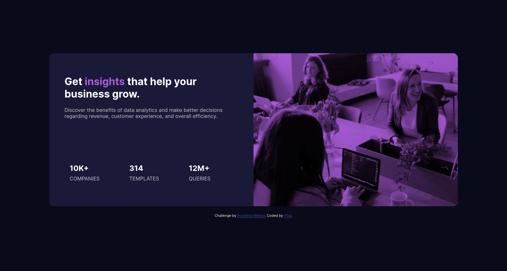
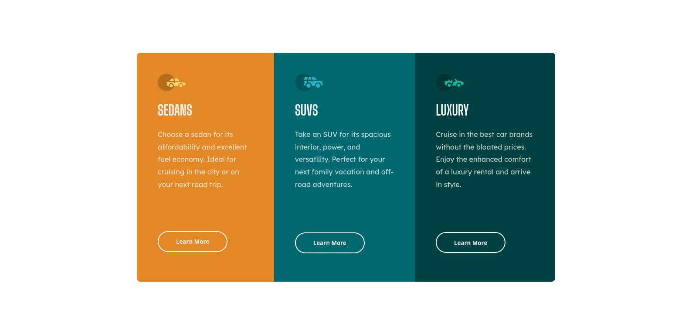
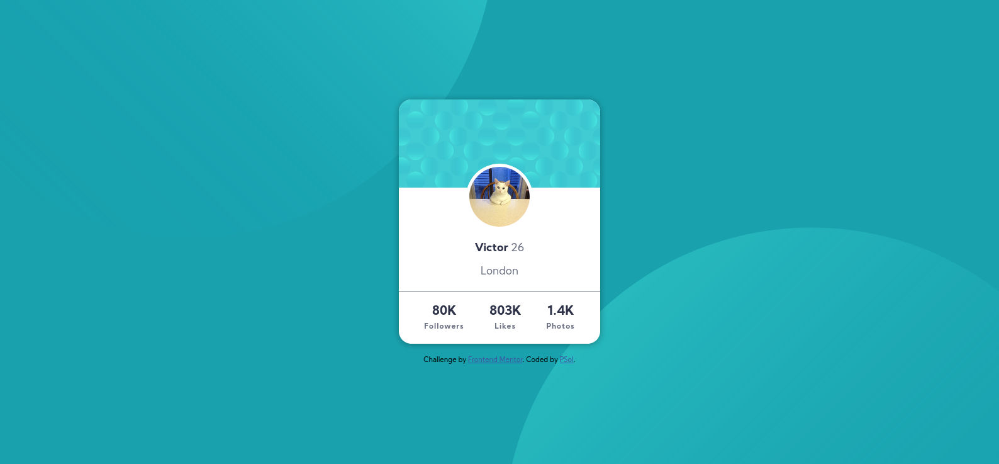
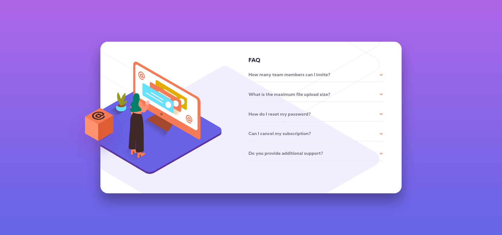
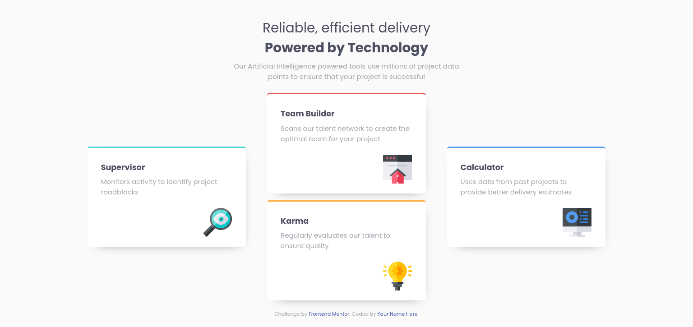
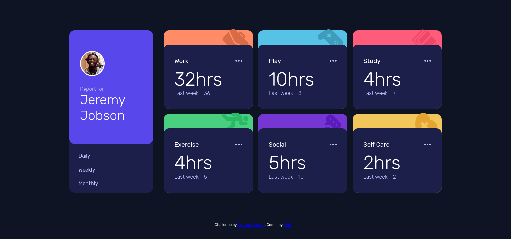

#Solutions to Frontend Mentor

### Stats Preview Card

- [Browser view](https://upsole.github.io/frontend_mentor/stats-preview-card-component/)
- [Repository](https://github.com/upsole/frontend_mentor/tree/master/stats-preview-card-component)

### Three Column Component

- [Browser view](https://upsole.github.io/frontend_mentor/3-column-preview-card-component-main/)
- [Repository](https://github.com/upsole/frontend_mentor/tree/master/3-column-preview-card-component-main)

### Profile Card Component

- [Browser view](https://upsole.github.io/frontend_mentor/profile-card-component-main/)
- [Repository](https://github.com/upsole/frontend_mentor/tree/master/profile-card-component-main)

### FAQ Accordion Card Component

- [Browser view](https://upsole.github.io/frontend_mentor/faq-accordion-card-main/)
- [Repository](https://github.com/upsole/frontend_mentor/tree/master/faq-accordion-card-main)

### Four Card Feature Section

- [Browser view](https://upsole.github.io/frontend_mentor/four-card-feature-section-master/)
- [Repository](https://github.com/upsole/frontend_mentor/tree/master/four-card-feature-section-master)

### Time Tracking Dashboard

- [Browser view](https://upsole.github.io/frontend_mentor/time-tracking-dashboard-main/)
- [Repository](https://github.com/upsole/frontend_mentor/tree/master/time-tracking-dashboard-main)

